```{r setup, include=FALSE,highlight=TRUE, background='#F7F7F7'}
library(tufte)
# invalidate cache when the tufte version changes
knitr::opts_chunk$set(cache.extra = packageVersion('tufte'))
options(htmltools.dir.version = FALSE)
```

::: {.fullwidth}
During last month's IEEE 802.11 standards meeting in Warsaw, my daily city wandering proved unexpectedly enriching. The hotel's prime location in the old town, nestled near the University of Warsaw, while the conference unfolded in the central district, created the perfect excuse for meaningful detours.

This daily four-mile ritual—a gentle two-mile stroll each morning and evening—turned ordinary travel time into moments of authentic exploration. Moving at an unhurried pace unveiled Warsaw's secret gems: quiet historic nooks, the pulse of street life, the city's bustling energy, and serene parks that remain invisible during the pace of typical conference schedules. One such day, I found myself on a familiar street that I'd walked before—the one that passes by the University of Warsaw library. The library's exterior walls are adorned with stunning inscriptions spanning humanity's intellectual heritage: ancient Sanskrit, Hebrew, Greek, Arabic, and Latin texts alongside musical notation and iconic scientific achievements like DNA structures and Maxwell's equations.
:::


```{r figWall, fig.margin = TRUE, fig.width= 8, fig.height= 8, fig.cap = "[The Warsaw University Library](https://www.buw.uw.edu.pl/en/about-us/about-the-library/building-and-garden/) wall featuring aspects of music (Karol Szymanowski's Etude in B minor op. 4, no. 3),culture and sciences.", message=TRUE, cache=TRUE, echo=FALSE, out.width='100%'}
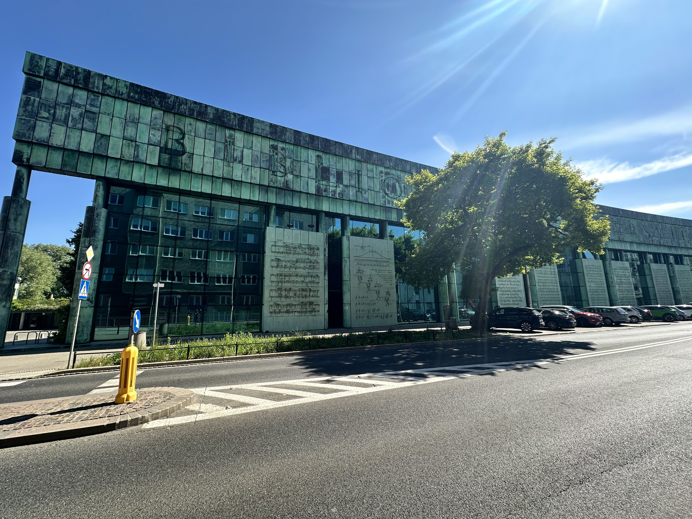
```


```{r figCollatzWarsaw, fig.margin = TRUE, fig.width= 8, fig.height= 8, fig.cap = "The library wall displays some of the biggest breakthroughs in science and technology. You can see familiar items like the bell curve signifying the Central Limit Theorem (along with Gaussian distribution function), the number π, DNA structures, and Maxwell's famous equations unifying electromagnetism. There are also a couple of interesting math pieces: one shows a complex sequence from advanced mathematics, and another contains a short computer program that explores the famous Collatz conjecture—a simple but unsolved math puzzle that has puzzled mathematicians for decades. ", message=TRUE, cache=TRUE, echo=FALSE, out.width='100%'}
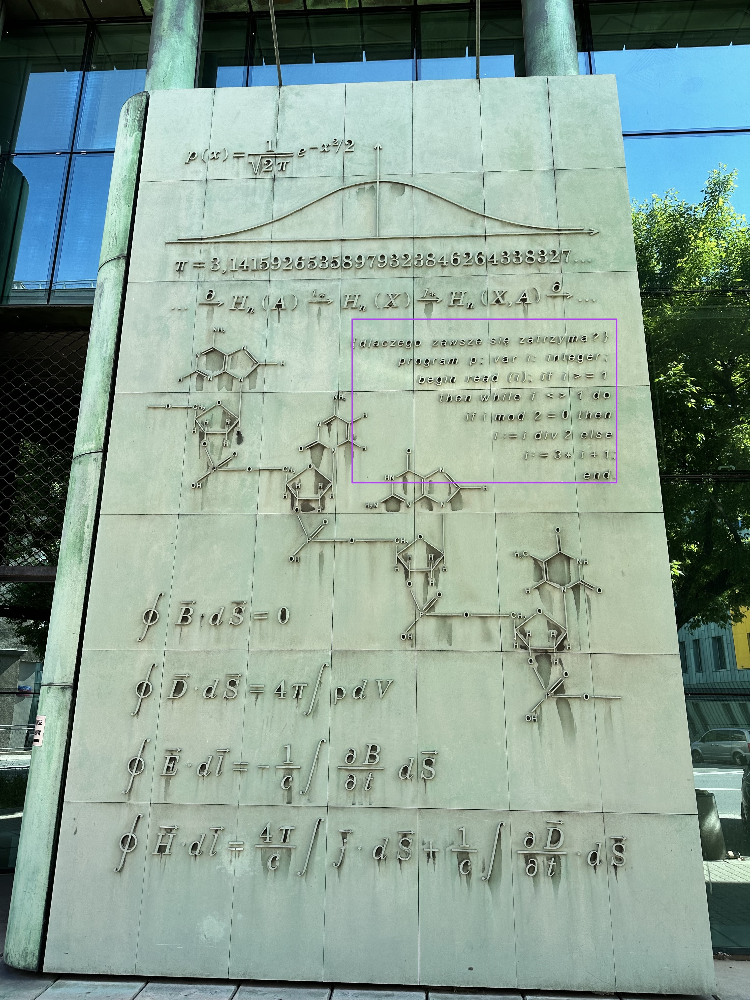
```


```{r figCollatz1, fig.margin = TRUE, fig.width= 8, fig.height= 8, fig.cap = "The first 25 Collatz sequences.", message=TRUE, cache=TRUE, echo=FALSE, out.width='100%'}
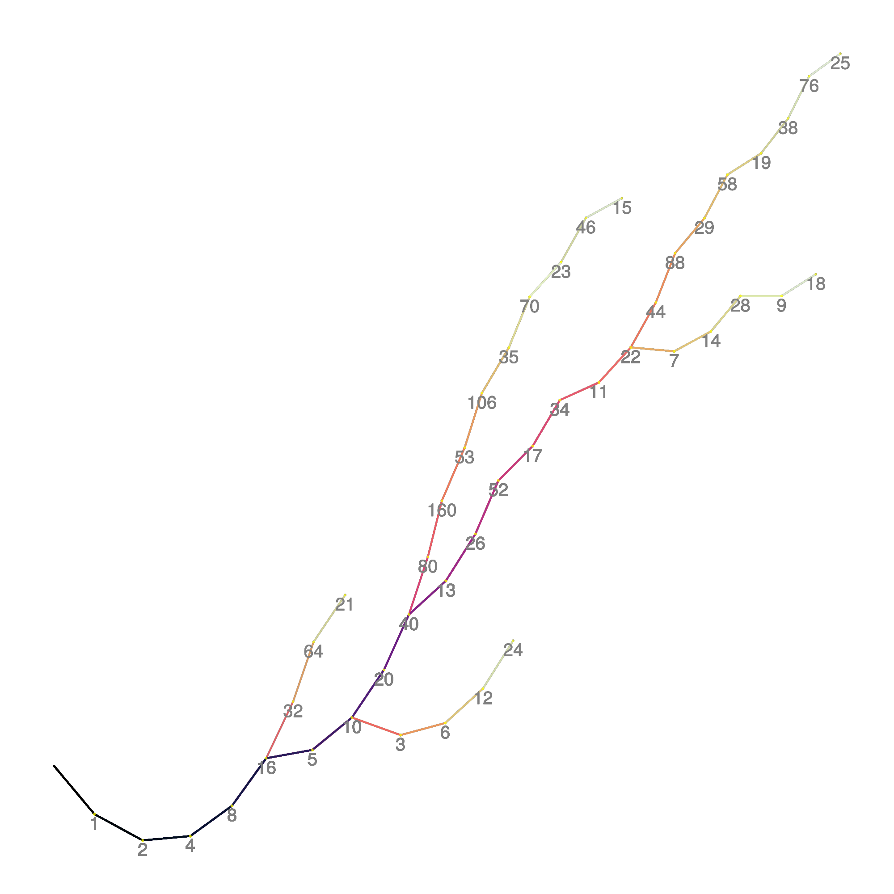
```


More than a decade ago, when first encountering this wall, I was more excited at spotting Maxwell's equations among the curated collection. But this time, something new emerged. Nestled above the Maxwell equations and DNA/RNA compound imagery was a small algorithmic snippet that had somehow been missed before—a brief program written in Pascal.

What was this mysterious code doing among the greatest achievements of human civilization? Upon closer examination, the code revealed something beautifully appropriate: a program for generating the Collatz sequence, one of mathematics' most famous unsolved puzzles, quietly holding its place alongside the other monuments to human curiosity and discovery.

```{marginfigure, fig.cap="A quote from Richard Guy"}
*“Don’t try to solve these problems!”* — Richard K. Guy, Amer. Math. Monthly 90 (1983), 35–41.
```


# A deceptively simple looking puzzle

The Collatz conjecture^[The Collatz conjecture goes by numerous names, including the 3n+1 problem, the 3x+1 problem, Ulam's conjecture, Thwaites' conjecture, and the Syracuse problem, among others. The problem's origins appear to stem from Lothar Collatz's notebooks dating to the 1930s and was circulating among mathematicians by the 1950s [XX]. The earliest published reference appears to be H. S. Coxeter's 1971 written lecture [XX]. For a comprehensive exploration of the problem's history, background, and broader mathematical significance, Jeffrey C. Lagarias's survey article provides an excellent resource [XX].] stands as one of mathematics' most tantalizingly simple yet stubbornly unsolved problems. Named after German mathematician Lothar Collatz [^LotharCollatz], who proposed it in 1937, this conjecture deals with a deceptively straightforward process that has confounded mathematicians for nearly a century. 

[^LotharCollatz]: Lothar Collatz, among other things has played a key role in the founding of spectral graph theory. https://en.wikipedia.org/wiki/Lothar_Collatz

```{r figCollatz1Margin, fig.margin = TRUE, fig.width= 8, fig.height= 8, fig.cap = "Collatz sequence for n=27. The sequence reaches 1 in 111 steps, making it one of the longer Collatz sequences for numbers under 30. ", message=TRUE, cache=TRUE, echo=FALSE, out.width='100%'}
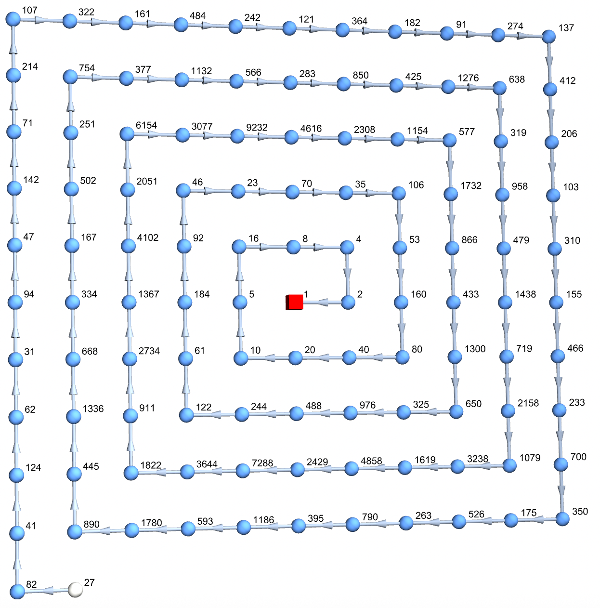
```

The rules are almost childishly simple. Take any positive integer. If it's even, divide it by two. If it's odd, multiply by three and add one. Repeat this process with each resulting number. The Collatz conjecture^[The process can be formalized mathematically as: Let $\mathbb{N} = \{0,1,2,\ldots\}$ denote the set of natural numbers and $\mathbb{N}^+ = \{1,2,\ldots\}$ denote the positive integers. The Collatz process involves repeatedly applying the function $f(x) = x/2$ for even $x \in \mathbb{N}$ and $f(x) = 3x + 1$ for odd $x$. Since $3x + 1$ yields an even result whenever $x$ is odd, we can define a streamlined variant $T$ where $T(x) = x/2$ for even $x$ and $T(x) = (3x + 1)/2$ for odd $x$. The Collatz conjecture asserts that repeated application of either $T$ or $f$ to any positive integer $x \in \mathbb{N}^+$ eventually reaches 1.] claims that no matter which positive integer you start with, you will always eventually reach the number 1.

Consider starting with 7, an arbitrary odd number. Following our rules: 7 becomes $22 = 3 \times 7+1$, then 11, then 34, then 17, then 52, then 26, then 13, then 40, then 20, then 10, then 5, then 16, then 8, then 4, then 2, and finally 1. Once you reach 1, the sequence enters an endless loop: 1, 4, 2, 1, 4, 2, and so on.

This behavior has been verified for every starting number tested, including all integers up to approximately $2^{68}$—that's roughly 295 quintillion numbers<sup>[1](#ref1)</sup> [^barina2021]. Computers have crunched through these calculations for decades, yet not a single counterexample has emerged. Despite this overwhelming computational evidence, no one has managed to prove that the pattern holds universally. 

[^barina2021]: Barina, D. et al. (2021). Computational verification of the Collatz conjecture.

Mathematically, the function mapping takes the form:

$$f(x) = \begin{cases}
x/2 & \text{if } x \in \text{even} \\
3x + 1 & \text{if } x \in \text{odd}
\end{cases}$$

In modular arithmetic notation, $f$ can be expressed as follows:

$$f(x) = \begin{cases}
x/2 & \text{if } x \equiv 0 \pmod{2} \\
3x + 1 & \text{if } x \equiv 1 \pmod{2}
\end{cases}$$

The conjecture states that regardless of the starting number $x$, the sequence will eventually reach $1$ after a finite number of steps, at which point it enters the perpetual cycle $4 \to 2 \to 1 \to 4$.


```{marginfigure, fig.cap=" With T(x)"}
Instead of the classic Collatz mapping $f(x)$, a streamlined variant $T(x)$ can also be used.:

$$T(x) = \begin{cases}
x/2 \quad \quad \quad  \text{if } x \equiv 0 \pmod{2} \\
(3x + 1)/2 \quad \text{if } x \equiv 1 \pmod{2}
\end{cases}$$

The Collatz sequence starting from $x = 21$ using the function $T$ is:

$$21 \to 32 \to 16 \to 8 \to 4 \to 2 \to 1$$

Step by step:
- $T(21) = (3 \cdot 21 + 1)/2 = 64/2 = 32$ (since 21 is odd)
- $T(32) = 32/2 = 16$ (since 32 is even)
- $T(16) = 16/2 = 8$ (since 16 is even)
- $T(8) = 8/2 = 4$ (since 8 is even)
- $T(4) = 4/2 = 2$ (since 4 is even)
- $T(2) = 2/2 = 1$ (since 2 is even)

The sequence reaches 1 in 6 steps. However, this report focuses exclusively on $f(x)$. 
```


```{r figCollatzTree1, fig.margin = FALSE, fig.width= 8, fig.height= 8, fig.cap = "First 25 collatz sequences. The numbers 1 to 25 are shown as white marbles. Visually the tree strucure appears with 1 as the root.", message=TRUE, cache=TRUE, echo=FALSE, out.width='100%'}
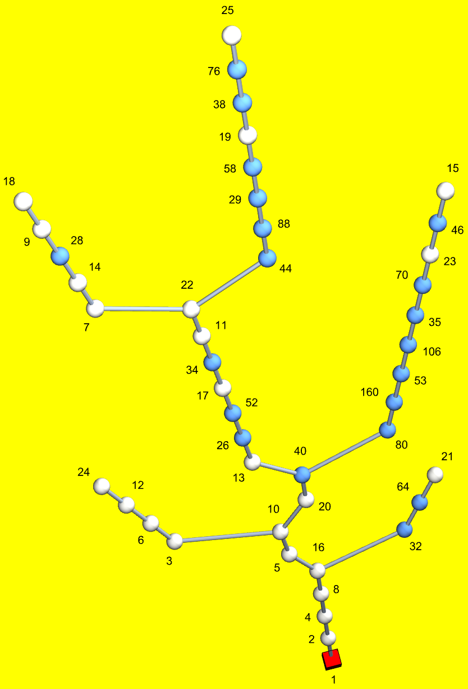
```

```{r figAll, fig.margin = TRUE, fig.cap = "The Collatz conjecture has gained significant attention in recent years, with substantial monetary prizes offered for its resolution and appearances in popular culture, including references in webcomics such as this. The enduring appeal of this problem lies in its accessibility—anyone can understand the basic concept—yet its proof remains elusive despite extensive mathematical investigation.", message=TRUE, cache=TRUE, echo=FALSE, out.width='100%'}
knitr::include_graphics("images/collatz_conjecture_xkcd.png")
```

Similarly, the sequence starting from $x = 21$ using the function $f$ is:

$$21 \to 64 \to 32 \to 16 \to 8 \to 4 \to 2 \to 1$$

Step by step:
- $f(21) = 3 \cdot 21 + 1 = 64$ (since 21 is odd)
- $f(64) = 64/2 = 32$ (since 64 is even)
- $f(32) = 32/2 = 16$ (since 32 is even)
- $f(16) = 16/2 = 8$ (since 16 is even)
- $f(8) = 8/2 = 4$ (since 8 is even)
- $f(4) = 4/2 = 2$ (since 4 is even)
- $f(2) = 2/2 = 1$ (since 2 is even)

The sequence reaches 1 in 7 steps.
The Collatz sequence starting from $x = 15$ using the function $f$ is:

$$15 \to 46 \to 23 \to 70 \to 35 \to 106 \to 53 \to 160 \to 80 \\
\to 40 \to 20 \to 10 \to 5 \to 16 \to 8 \to 4 \to 2 \to 1$$

Step by step:
- $f(15) = 3 \cdot 15 + 1 = 46$ (since 15 is odd)
- $f(46) = 46/2 = 23$ (since 46 is even)
- $f(23) = 3 \cdot 23 + 1 = 70$ (since 23 is odd)
- $f(70) = 70/2 = 35$ (since 70 is even)
- $f(35) = 3 \cdot 35 + 1 = 106$ (since 35 is odd)
- $f(106) = 106/2 = 53$ (since 106 is even)
- $f(53) = 3 \cdot 53 + 1 = 160$ (since 53 is odd)
- $f(160) = 160/2 = 80$ (since 160 is even)
- $f(80) = 80/2 = 40$ (since 80 is even)
- $f(40) = 40/2 = 20$ (since 40 is even)
- $f(20) = 20/2 = 10$ (since 20 is even)
- $f(10) = 10/2 = 5$ (since 10 is even)
- $f(5) = 3 \cdot 5 + 1 = 16$ (since 5 is odd)
- $f(16) = 16/2 = 8$ (since 16 is even)
- $f(8) = 8/2 = 4$ (since 8 is even)
- $f(4) = 4/2 = 2$ (since 4 is even)
- $f(2) = 2/2 = 1$ (since 2 is even)

The sequence reaches 1 in 17 steps. 


The conjecture's difficulty lies in its chaotic nature. Small changes in starting values can lead to dramatically different trajectories. Some numbers reach 1 quickly, while others embark on wild journeys, soaring to heights thousands of times larger than their starting point before eventually descending. The number 27, for instance, reaches a peak of 9,232 during its 111-step journey to 1.

::: {.fullwidth}
The Collatz sequence starting from $x = 27$ using the function $f$ is:

$$\begin{align}
27 &\to 82 \to 41 \to 124 \to 62 \to 31 \to 94 \to 47 \to 142 \to 71 \to 214 \to 107 \to 322 \to 161 \to 484 \\
&\to 242 \to 121 \to 364 \to 182 \to 91 \to 274 \to 137 \to 412 \to 206 \to 103 \to 310 \to 155 \to 466 \\
&\to 233 \to 700 \to 350 \to 175 \to 526 \to 263 \to 790 \to 395 \to 1186 \to 593 \to 1780 \to 890 \\
&\to 445 \to 1336 \to 668 \to 334 \to 167 \to 502 \to 251 \to 754 \to 377 \to 1132 \to 566 \to 283 \\
&\to 850 \to 425 \to 1276 \to 638 \to 319 \to 958 \to 479 \to 1438 \to 719 \to 2158 \to 1079 \\
&\to 3238 \to 1619 \to 4858 \to 2429 \to 7288 \to 3644 \to 1822 \to 911 \to 2734 \to 1367 \\
&\to 4102 \to 2051 \to 6154 \to 3077 \to 9232 \to 4616 \to 2308 \to 1154 \to 577 \to 1732 \\
&\to 866 \to 433 \to 1300 \to 650 \to 325 \to 976 \to 488 \to 244 \to 122 \to 61 \to 184 \\
&\to 92 \to 46 \to 23 \to 70 \to 35 \to 106 \to 53 \to 160 \to 80 \to 40 \to 20 \to 10 \\
&\to 5 \to 16 \to 8 \to 4 \to 2 \to 1
\end{align}$$
:::


What makes the Collatz conjecture particularly fascinating is how it embodies the tension between simplicity and complexity that pervades mathematics. The problem requires no advanced mathematical background to understand, yet it has resisted the efforts of some of the world's brightest mathematical minds^[The Collatz conjecture remains one of mathematics' most intractable problems, with a solution appearing distant despite over fifty years of intensive research efforts. Jeffrey C. Lagarias has provided excellent comprehensive coverage of this research in his surveys and dedicated monograph on the subject. Currently, the most significant advance toward resolving the conjecture comes from Terrence Tao, who demonstrated that almost all positive integers eventually reach 1 under Collatz iterations, at least in a probabilistic sense (Tao also has a blog post on this topic dated in 2019 [https://terrytao.wordpress.com/2019/09/10/almost-all-collatz-orbits-attain-almost-bounded-values/]). The problem's notorious difficulty is captured in Paul Erdős's famous assessment that "Mathematics is not yet ready for such problems," and he reportedly characterized it as "Hopeless. Absolutely hopeless.". The conjecture's daunting nature is further emphasized by its inclusion as Problem 2 in Richard Guy's cautionary 1983 paper "Don't try to solve these problems!"]. Terence Tao has made significant progress on related problems, but the full conjecture remains open.

The conjecture connects to deep areas of mathematics including number theory, dynamical systems, and computational complexity. Some mathematicians have developed sophisticated techniques to analyze special cases or prove weaker versions of the statement, but the general problem maintains its grip on the mathematical imagination.

Perhaps most remarkably, the Collatz conjecture serves as a reminder that in mathematics, the most profound mysteries often hide behind the simplest facades. In a world where we can predict the motion of planets and decode the structure of DNA, a rule simple enough for a child to understand continues to guard its secrets, challenging our understanding of the very nature of numbers themselves.


# Visualizing the Collatz sequences

Personally, the most catchy aspect of this puzzle is the structure and geometry of the sequence. Since the conjecture points to the inevitability of tracing to a fixed point loop into $2 \to 1$, it naturally gives rise to a fascinating tree structure, where multiple starting values converge along shared pathways before ultimately reaching the root at 1. 


## Collatz twig

```{r figCollatzTree3DFull, fig.fullwidth=TRUE,fig.margin = FALSE, fig.cap = "The first 10000 collatz sequences as a graph.", message=TRUE, cache=TRUE, echo=FALSE, out.width='100%'}
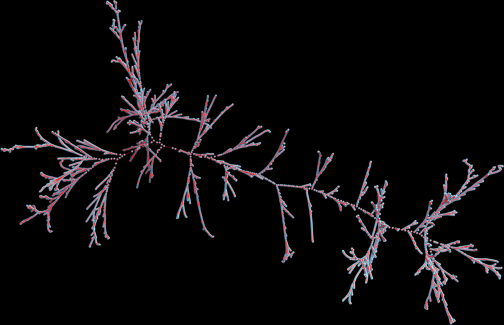
```


```{r figCollatz20Kmath, fig.margin = TRUE, fig.width= 8, fig.height= 8, fig.cap = "The first 15000 collatz sequences as a graph resembling a snow flake.", message=TRUE, cache=TRUE, echo=FALSE, out.width='100%'}
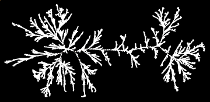
```


```{r figCollatzMargin3K, fig.margin = TRUE, fig.width= 8, fig.height= 8, fig.cap = "Collatz sequence resembling river/drainage patterns. The first 1000 sequences are plotted as an undirected graph.", message=TRUE, cache=TRUE, echo=FALSE, out.width='100%'}
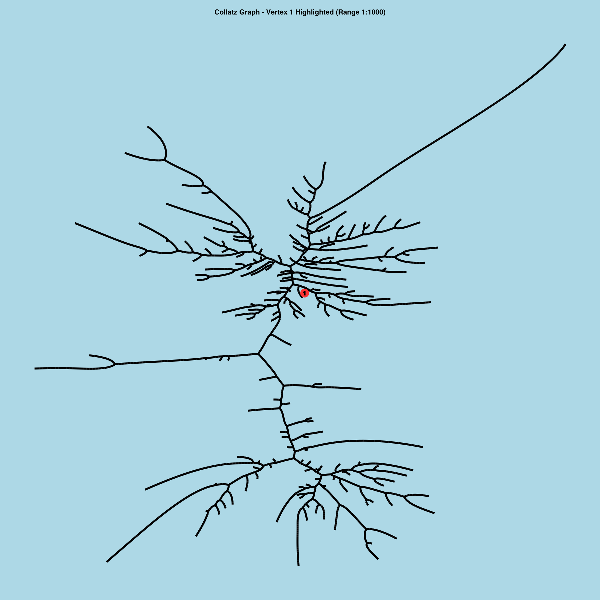
```

```{r figCollatzHangingTree1000, fig.margin = TRUE, fig.width= 8, fig.height= 8, fig.cap = "The first 1000 Collatz sequences shown as a graph resembling decorative beeds hanging. ", message=TRUE, cache=TRUE, echo=FALSE, out.width='100%'}
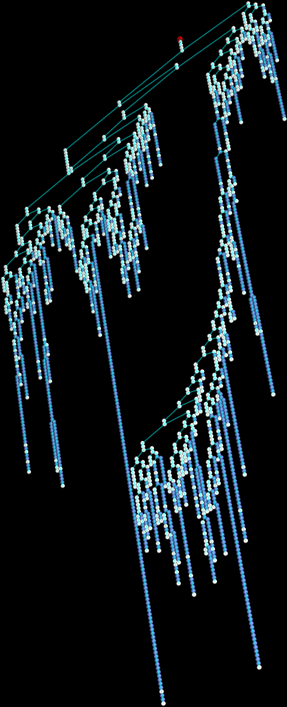
```


In this forward-flowing tree, different positive integers begin on separate branches but gradually merge as their sequences progress, creating a river-like pattern where tributaries join the main stream. For example, the sequences from 8, 16, 32, and other powers of 2 form a simple linear branch leading directly to 1, while more complex starting values like 27 or 15 follow winding paths that eventually intersect with simpler trajectories. The tree structure reveals how certain intermediate values, such as 4, 2, and 1, serve as convergence points where multiple sequences unite, creating bottlenecks in the flow toward the root. This convergent behavior demonstrates the conjecture's claim that all paths eventually funnel into the same final sequence ($4 \to 2 \to 1$), regardless of their diverse and seemingly chaotic initial trajectories. The tree's branching complexity reflects the unpredictable nature of Collatz sequences while illustrating the underlying unity that the conjecture asserts exists among all positive integers. 


## Collatz sequences like ocean plants 

The Collatz tree structure remarkably resembles underwater kelp forests or coral formations, with their characteristic flowing, organic architecture. Like ocean plants swaying in deep currents, the Collatz sequences exhibit a graceful, fluid motion as they cascade from diverse starting points toward the central root at 1. 

The numerous branches spread outward like fronds or coral polyps, each following its own meandering path through the mathematical seascape before being swept into the main current. Just as kelp forests create dense, layered canopies with multiple organisms sharing the same water column, different Collatz sequences occupy overlapping numerical territories, eventually merging into common channels like schools of fish converging toward feeding grounds.

The intricate sequences branch and flow like underwater kelp forests, with longer, complex paths resembling graceful tendrils that drift and undulate through mathematical space before merging into deeper currents. Shorter sequences mirror the direct, upward growth of simpler aquatic vegetation. This oceanic analogy reflects the organic, almost biological nature of Collatz dynamics, where numerical sequences converge in patterns reminiscent of natural ecosystems—all flowing together to form a unified, tree-like structure anchored at the fundamental point of 1.
The visualization below, created in Julia and inspired by the elegant work at https://github.com/dkobak/collatz-viz, illustrates this phenomenon by mapping the first 10,000 Collatz sequences, revealing the striking botanical architecture that emerges from pure mathematical iteration.

::: {.fullwidth}

```{r figCollatz10K, fig.margin = FALSE, fig.fullwidth = TRUE, fig.width= 8, fig.height= 8, fig.cap = "The first 10000 collatz sequences depicted like an underwater plant swaying under the influence of the ocean current. This is an image that I generated using Julia (See the package CollatzConjecture.jl which has routines to reproduce this image) after deriving motivation from this image [https://upload.wikimedia.org/wikipedia/commons/8/8f/Collatz_conjecture_tree_visualization.png]", message=TRUE, cache=TRUE, echo=FALSE, out.width='100%'}
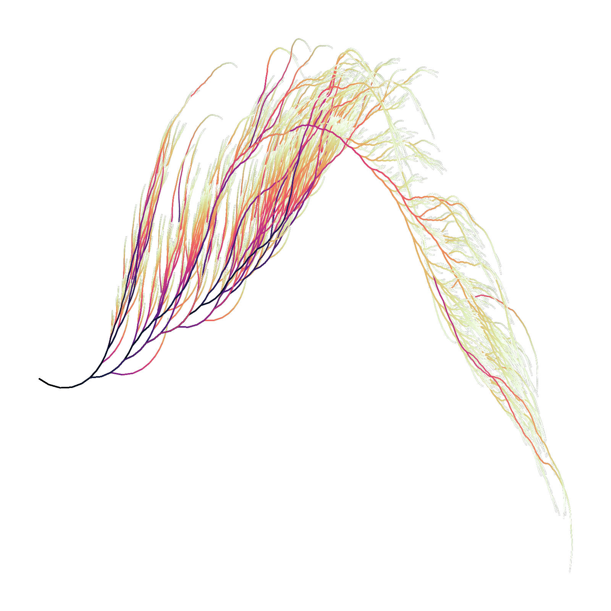
```
:::


# Complex Generalization. Enters fractals

While the traditional Collatz function involves repeatedly applying the rule "if even, divide by 2; if odd, multiply by 3 and add 1," generalizing this process to complex numbers reveals intricate fractal structures that illuminate the conjecture's deeper mathematical nature.


```{r figFractal1, fig.margin = FALSE,fig.fullwidth = TRUE, fig.cap = "Collatz fractal. This is a familiar image that is widely shared over internet such as [https://njohnston.ca/2009/06/the-collatz-conjecture-as-a-fractal/] ", message=TRUE, cache=TRUE, echo=FALSE, out.width='100%'}
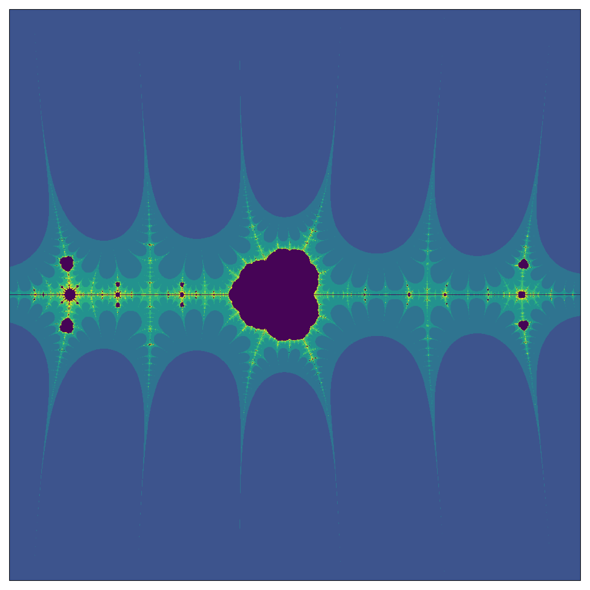
```

```{r figFracMarg1, fig.margin = TRUE, fig.cap = "Fractal behavior near n=77, within 25 iterations of the collatz process evolution.", message=TRUE, cache=TRUE, echo=FALSE, out.width='120%'}
knitr::include_graphics("images/collatz_fractal_zoom-n77.0-maxIter25.png")
```

```{r figCollatzScatter, fig.margin = TRUE, fig.width= 8, fig.height= 8, fig.cap = "Stopping times. The stopping time of a Collatz sequence refers to the number of iterations required for a given starting value to reach 1. This fundamental measure varies dramatically across different initial values, exhibiting seemingly erratic behavior that defies simple prediction. For instance, while some numbers like powers of 2 have relatively short stopping times (since they only require repeated division by 2), others can have surprisingly long trajectories before converging to 1. The number 27, despite being relatively small, requires 111 steps to reach 1, demonstrating how stopping times can be unexpectedly large even for modest starting values. Understanding the distribution and behavior of stopping times remains one of the central challenges in Collatz conjecture research, as no general formula exists to predict the stopping time of an arbitrary positive integer without actually computing the entire sequence.", message=TRUE, cache=TRUE, echo=FALSE, out.width='100%'}
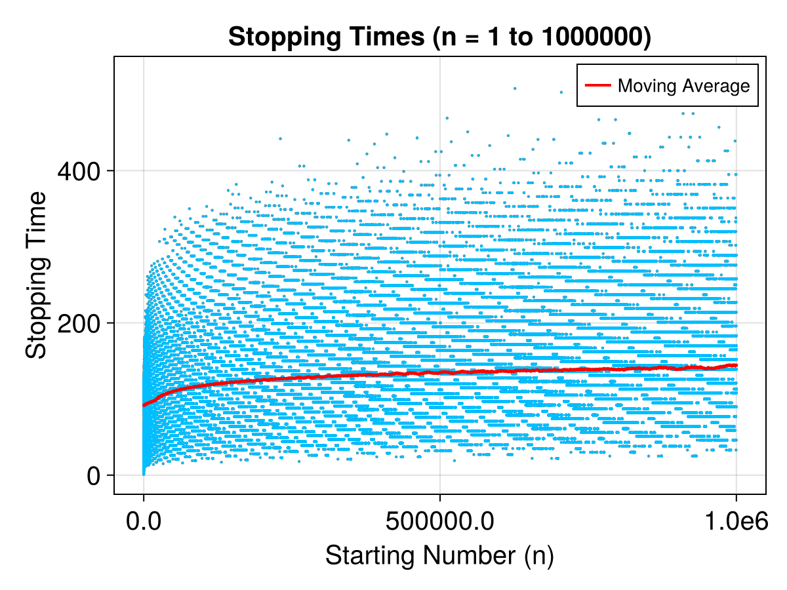
```

Fractals represent infinitely complex, self-repeating patterns that maintain their structure across multiple scales. These mathematical objects emerge from the iterative application of simple processes through recursive feedback loops, generating visual representations of dynamic systems and chaotic behavior. Geometrically, fractals occupy non-integer dimensions, existing between the conventional whole-number dimensions of classical geometry.
These intricate patterns pervade the natural world, appearing in diverse forms such as branching tree structures, meandering river networks, irregular coastlines, mountain ranges, cloud formations, spiral seashells, and swirling hurricane systems. The ubiquity of fractal geometry in nature reflects the underlying mathematical principles that govern complex systems and organic growth processes.


## Collatz fractal

Extending the Collatz function to the complex plane requires replacing the discrete parity test with a continuous analogue, since the concept of "even" or "odd" doesn't directly apply to complex numbers.

The original integer-based Collatz function can be rewritten in several equivalent forms:

$$\begin{aligned}
f(z) &= \begin{cases}
z/2 & \text{if } z \equiv 0 \pmod{2} \\
3z + 1 & \text{if } z \equiv 1 \pmod{2}
\end{cases} \\
&= \left(1 + (-1)^{z}\right) \frac{z}{4} + \left(1 - (-1)^{z}\right) \frac{3z+1}{2} \\
&= \frac{1}{4}  \left( 2 + 7z - (2 + 5z) (-1)^{z} \right)
\end{aligned}$$

The key insight for complexification comes from recognizing that for integer values of $z$, we have $\cos(\pi z) = (-1)^z$. This trigonometric identity provides a pathway to extend the function beyond integers to the entire complex plane.

Substituting this relationship yields the complex-extended Collatz function:

$$f(z) = \frac{1}{4}  \left( 2 + 7z - (2 + 5z)\cos(\pi z) \right)$$

This elegant formulation preserves the original behavior on integers while enabling smooth interpolation between the two Collatz operations. When $z$ is even, $\cos(\pi z) = 1$, recovering $f(z) = z/2$. When $z$ is odd, $\cos(\pi z) = -1$, yielding $f(z) = 3z + 1$. For non-integer complex values, the cosine function creates a continuous bridge between these discrete cases, allowing the Collatz process to operate seamlessly across the complex plane. 


::: {.fullwidth} 


```{r figFracFull, fig.fullwidth = TRUE, fig.margin = FALSE, fig.cap = "Collatz fractal behavior at different integer boundaries. Here the behavior is captured with a maximum of 26 iterations. The escape criterion is $\\lvert z \\rvert > 10000$ and the convergence criterion is $\\lvert z \\rvert <2$. ", message=TRUE, cache=TRUE, echo=FALSE, out.width='100%'}
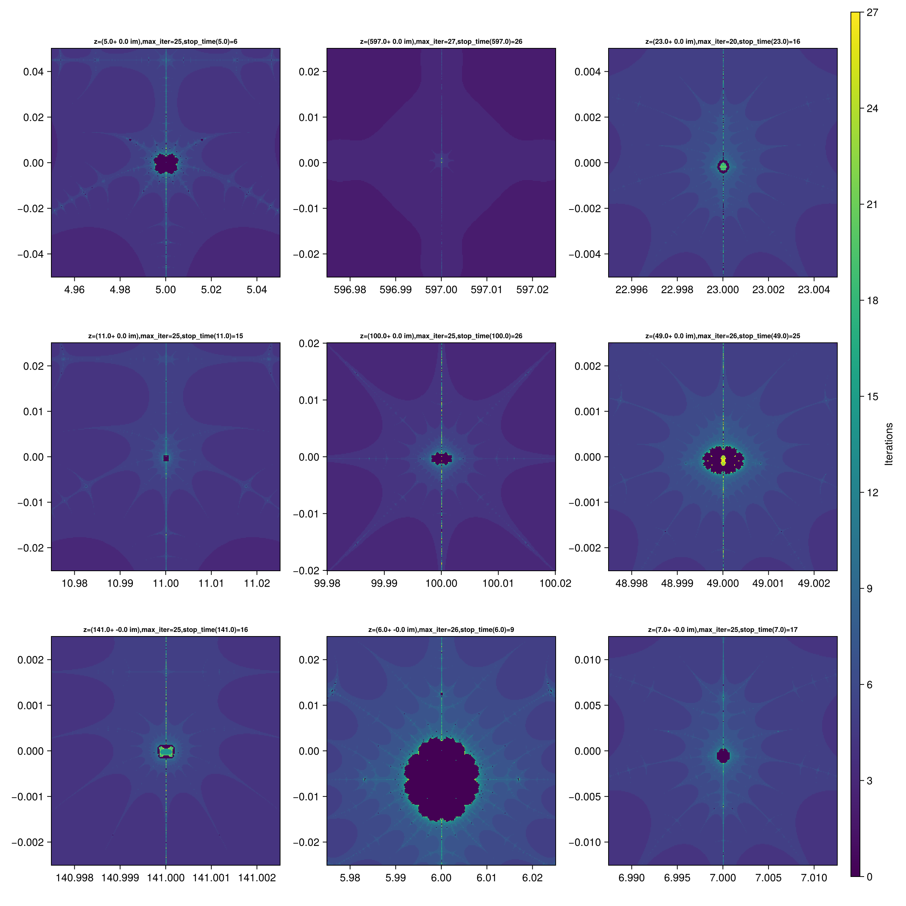
```
:::


A closer examination (i.e., zoom finer to the integers) reveals an intricate, almost mystical pattern emerging at integer starting points. In this visualization, colors represent the number of iterations required for each point to either converge to 1 or diverge to infinity (with the escape threshold set at |z| > 10,000 for demonstration purposes)..    

::: {.fullwidth} 

```{r figFracFull_fine, fig.fullwidth = TRUE,fig.margin = FALSE, fig.cap = "Close in behavior around some integer boundaries. Here the behavior is captured with a maximum of 26 iterattions. The escape criterion is $\\lvert z \\rvert > 10000$ and the convergence criterion is $\\lvert z \\rvert <2$.", message=TRUE, cache=TRUE, echo=FALSE, out.width='100%'}
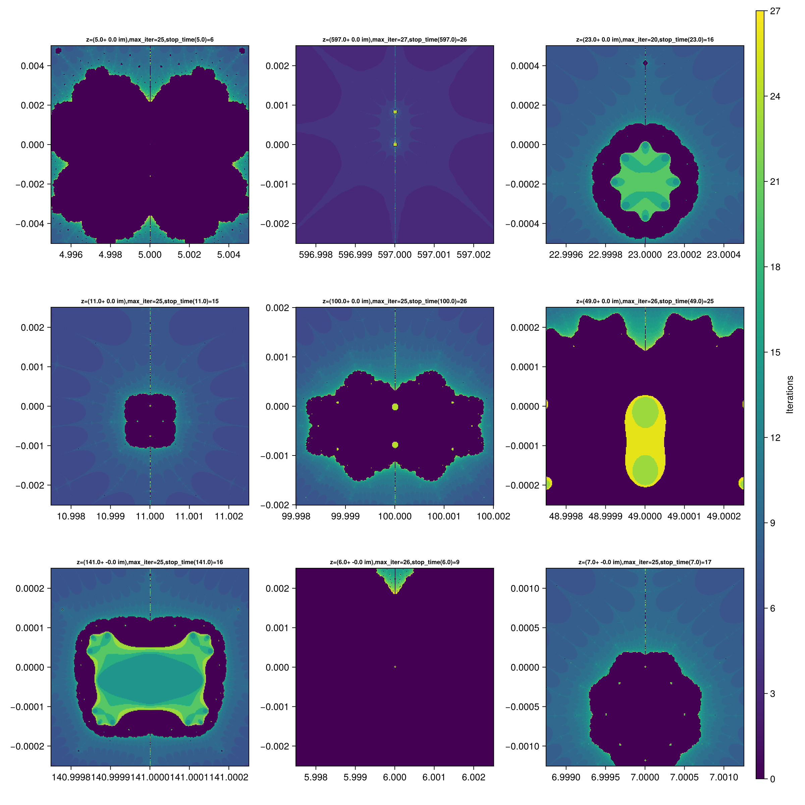
```
:::


```{r figCollatzHist, fig.margin = TRUE, fig.width= 8, fig.height= 8, fig.cap = "Histogram of stopping times. The distribution of stopping times in Collatz sequences exhibits remarkable irregularity and has been the subject of extensive empirical investigation. Computational studies reveal that while most integers have relatively modest stopping times, the distribution has a heavy tail with occasional numbers requiring exceptionally long trajectories to reach 1. Statistical analyses suggest that stopping times appear to follow a roughly logarithmic growth pattern on average, though with substantial variance and no discernible pattern for predicting individual cases. Empirical evidence indicates that stopping times are distributed approximately according to a geometric-like distribution when properly normalized, but proving theoretical results about this distribution remains elusive. The apparent randomness in stopping time behavior has led some researchers to conjecture that Collatz sequences exhibit pseudo-random properties, making the distribution of stopping times one of the most intriguing yet unresolved aspects of the conjecture", message=TRUE, cache=TRUE, echo=FALSE, out.width='100%'}
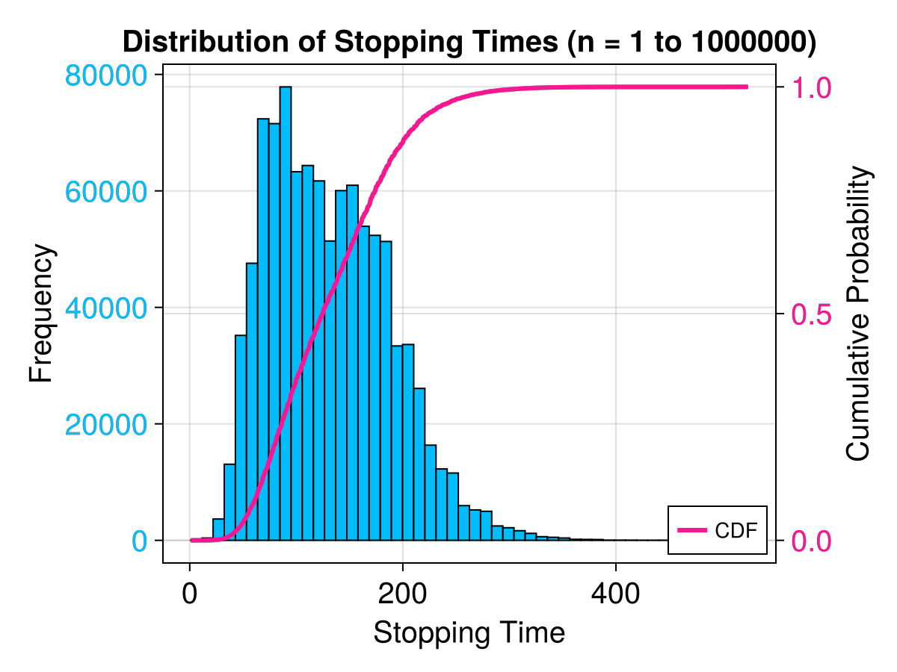
```

## Fractal Emergence
Iterating this complex Collatz function produces remarkable fractal patterns. The key lies in studying the basins of attraction—regions in the complex plane where initial values converge to specific behaviors under iteration. Some trajectories spiral toward fixed points, others exhibit periodic behavior, and many diverge to infinity in intricate spiral patterns.

The boundary between convergent and divergent regions forms a fractal with infinite detail at every scale. Unlike the relatively simple dynamics on the real line, the complex plane reveals tendrils, spirals, and self-similar structures that extend infinitely. These patterns often exhibit characteristics reminiscent of the fractal images seen elsewhere.

# Whats the meaning of all these afterall?

The exploration of complex Collatz fractals reveals something profound about the nature of mathematical truth itself. These stunning visualizations demonstrate how a deceptively simple rule can unleash boundless complexity and unexpected beauty when extended into the complex plane, offering potentially transformative insights into one of mathematics' greatest unsolved puzzles.

Greg Muller's compelling perspective from a 2010 math.stackexchange discussion captures the deeper philosophical implications beautifully: 

::: {.fullwidth}
<div style="background-color: #f0f8ff; border-left: 4px solid #4682b4; padding: 15px; margin: 20px 0; border-radius: 5px;">
<em>"So, the Collatz conjecture seems to say that there is some sort of abstract quantity like 'energy' which cannot be arbitrarily increased by adding 1. That is, no matter where you start, and no matter where this weird prime-shuffling action of adding 1 takes you, eventually the act of pulling out 2s takes enough energy out of the system so that you reach 1. I think it is for reasons like this that mathematicians suspect that a solution of the Collatz conjecture will open new horizons and develop new and important techniques in number theory."</em>

(math.stackexchange)[https://math.stackexchange.com/questions/2694/what-is-the-importance-of-the-collatz-conjecture].
<div style="text-align: right; margin-top: 10px;">— Greg Muller, 2010</div>

</div>
:::

This observation illuminates why the Collatz conjecture continues to captivate mathematicians worldwide. Far from being merely an abstract curiosity, it may hold keys to understanding fundamental principles governing mathematical systems—principles that could revolutionize our approach to number theory and unlock entirely new mathematical territories. The journey from an ordinary looking puzzle to these mesmerizing fractal landscapes reminds us that mathematics remains humanity's greatest adventure, where the simplest questions often lead to the most extraordinary detour and possible new discoveries.

# References

<a name="ref1"></a>
1. Barina, David. "Convergence verification of the Collatz problem." The Journal of Supercomputing 77, no. 3 (2021): 2681-2688. https://www.fit.vut.cz/research/publication-file/12315/postprint.pdf 

<a name="ref2"></a>
2. Lagarias, Jeffrey C. "The 3x+ 1 problem: An overview, 2021." URL https://arxiv. org/abs/2111.02635.

<a name="ref2a"></a>
3. Lagarias JC, editor. The Ultimate Challenge: The $3 x+ 1$ Problem. American Mathematical Society; 2023 Apr 19.

<a name="ref4"></a>
4. Tao, Terence. "Almost all orbits of the Collatz map attain almost bounded values." In Forum of Mathematics, Pi, vol. 10, p. e12. Cambridge University Press, 2022.

<a name="ref5"></a>
5. Coxeter, H. S. M. "Cyclic sequences and frieze patterns." The Ultimate Challenge: The (1971): 211-217.

<a name="ref6"></a>
6. https://www.prnewswire.com/news-releases/bakuage-offers-prize-of-120-million-jpy-to-whoever-solves-collatz-conjecture-math-problem-unsolved-for-84-years-301326629.html

<a name="ref7"></a>
7. https://mathprize.net/posts/collatz-conjecture/


```{r bib, include=FALSE}
# create a bib file for the R packages used in this document
knitr::write_bib(c('base', 'rmarkdown'), file = 'skeleton.bib')
```
